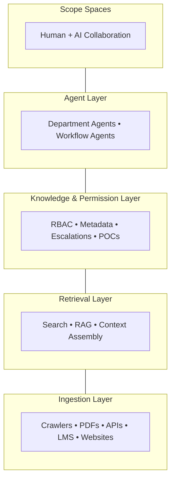

# UniAI
**Multi-agent AI copilot for universities** — Built from scratch, live at Ashoka University with 3,000+ students, scaling to admins, faculty, and students across universities.

---

> **TL;DR** — UniAI is a production-grade institutional intelligence layer serving 3,000+ users at Ashoka University. It unifies fragmented university knowledge across 30K+ dynamic endpoints, automates role-based access without manual intervention, routes escalations to the right human every time, and opens all of this up as an API layer for external platforms — making every corner of the university accessible, searchable, and actionable.

---

## The Problem

I started writing the code for UniAI because I was frustrated with a simple but expensive problem: **institutional knowledge is fragmented.**

Policies and information live across dozens of department websites, learning management systems, public websites, and so on. Administrative processes are scattered across portals, PDFs, emails, and internal systems. UniAI started out as a simple chatbot side project; now, it is the **institutional intelligence layer** that makes university knowledge accessible and university workflows of students, faculty, and admins alike — powered with multi-agentic capabilities.

---

## What It Comprises

### Smart Ingestion Pipeline
An ingestion pipeline aware of the key things UniAI optimizes for — **correctness, staleness/freshness, and intelligent automation.** Nobody has to fetch the relevant context; every prompt you type is backed by everything you are in the university context, based on the RBAC system — supported by automated data ingestion from different sources upon changes, which dynamically learns from user interaction — optimized to utilize the **seasonality of information** in a university setting.

### Automated RBAC at Scale
Universities are deeply vertical, so role-based access is a trivial need. Manually setting RBAC for each document in a knowledge base comprising **30K+ dynamic endpoints**, hundreds of PDFs across departments, and data across applications — that is what is not trivial. UniAI handles it natively with a **robust LLM-assisted pipeline with a human-in-the-loop mechanism**, making sure that sensitive and important data automatically reaches the right departmental POC to ensure it reaches the right audience.

### Intelligent Escalation
A robust escalation mechanism ensures queries are never lost in re-routing across departments. Upon user escalation, UniAI figures out who the right human (POC) is to reach out to. **POCs can employ agents to work on their behalf**, where agents are enriched with the capabilities, permissions, and context that define the POC of a certain department.

### Fine-Grained Knowledge Management
Fine-grained knowledge management pushing decentralisation of information at the fundamental level, allowing documents ranging from private departmental memos to policies for a wider audience to be set or changed dynamically — assisted by **UniAI's metadata suggestion engine** which learns from POCs over time.

### AI-Powered Collaboration — Scope Spaces
With the capabilities mentioned above as a base layer, collaboration that is natural in universities is powered by AI. Goals are achieved, milestones are brainstormed, and even daily workflows involving multiple people are done better as a group. UniAI's feature called **Scope Spaces** allows humans and AIs — aware of necessary context and powered with agentic capabilities connecting different applications — to collaborate and produce the best work.

### Identity & Access Layer
UniAI's identity and access layer builds a **canonical context model** that unifies a user's role, department membership, and institutional permissions into a single enriched identity — passed downstream to every agent and retrieval call.

### Open Intelligence Layer
UniAI's capabilities are not contained within the UniAI platform alone. It acts as an **intelligence layer for anyone** with requirements that could be powered by the robust capabilities described above, through API access.

---

## Stack
Python, FastAPI, gRPC, React, TypeScript, Qdrant, Redis, PostgreSQL, Google OAuth 2.0, Docker, Azure
## Team 
Karthik Sunil (Engineering) · Karan Kapadia Ishan Yellurkar (Business & Partnerships)
