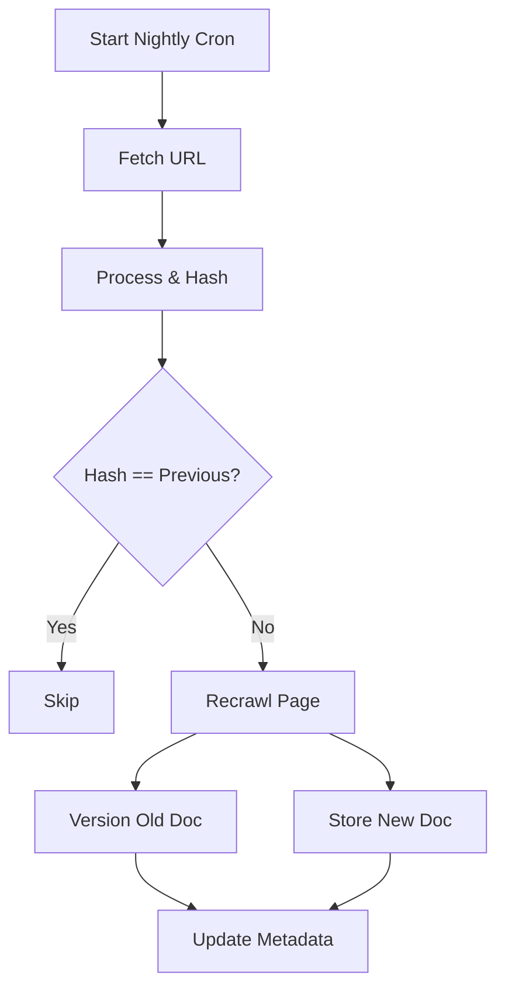
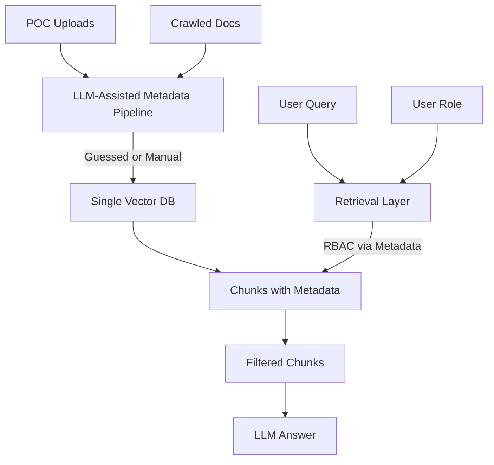
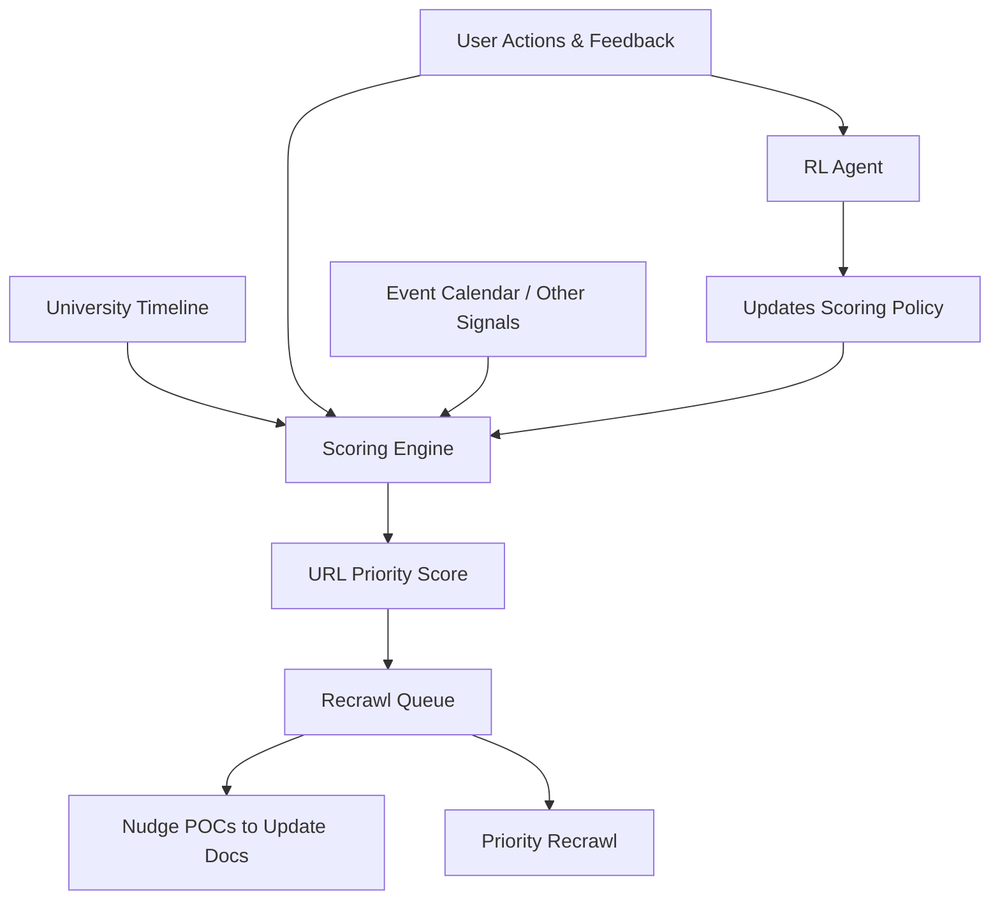

# The Thing About Staleness

## How It Started (And The Snarky Emails)

The way it started did not require me to think much. Initially, all I did was a full website crawl and the basic chunking → embedding → RAG pipeline. Then I deployed it, people started using it, and I started getting emails. Snarky comments about how this app is dumb because it is giving outdated answers — which was the only thing it had to do.

I used to avoid it by saying that a model is only as good as what you feed it. And there, right there, was the answer I needed.

## The Staleness Problem

Universities are fast-moving spaces. There are tons of documents, policies, emails, and much more. The important thing is that these are essential pieces of information used by all stakeholders very often. This is clearly not some policy document that no one ever reads. Therefore, maintaining accuracy is literally the first requirement.

Of course, the naive answer was to have a dashboard to upload the latest documents, but it is naive precisely because it is not scalable. I would not do it myself — well, I do not have any incentive to. Maybe someone from the Admin — who would want to do such boring tasks?

To study this better, I reached out to the IT department. I realized that things are pretty scattered in different departmental silos, WordPress DBs, and so on. Well, that is an infrastructure problem, not what I am solving for. So I had to figure out a way to make the system smart regardless of where and how the data is stored.

## The Hashing Band-Aid

I tried a hashing approach. It goes like this:

- Crawl all the sources. Maintain metadata involving last crawl, hash after processing, and a few other things (not relevant here).
- Run a cron job each night. Go fetch the page, process it (of course no embedding happens here), compare the hash.
- If hash is unequal, assume something has changed, and recrawl it. Version the old and the new document.

Computing hashes for random 5k+ URLs (+ other sources) is not very elegant. I had to ship fast, and I had to make sure that people used it and came back to it. A few ideas I had were really intense to cook up with the time I had. I will discuss those later. But for now, here is what I did given the constraints.

One issue that surfaced was that hashing only takes care of one kind of staleness:

1. **Docs change on the website and other sources.** Easy catch — our hashing mechanism will find it.
2. **Docs stay wherever they are, but real life changes.**

For example, one of the older handbooks was still on the website, and the newer one was somewhere else as well (maybe the crawler missed it). The agent very confidently retrieved the old data and presented it.

I mean, this could be solved in many ways. But let me first walk you through my assumptions.

## What I Assumed (And Why That Mattered)

The first thing is that we assume that whatever is in the public webpage as an endpoint, or whatever the POC uploads, is the latest data. We cannot assume the same about the documents uploaded — it varies from stuff that was out there from the initial days until now.

Now there are many ways, as I talked about. I will list a few here and explain why I did not do them.

## The Roads Not Taken

**Parsing URLs for dates.** Each content URL in the university that I am working with has a clear pattern: `wp-content/2026/yada-yada`. Of course, why can't I parse the URL, get the date, and solve the time blindness of the RAG pipeline? The thing is, an older document could be uploaded at a later date again. URLs are sometimes not consistent — there were exceptions. Now if I were to fetch these URLs and extract the date, another problem surfaces. Our hashing system assumes that there is a consistent source of information. Tomorrow, if the media team decides to upload documents in Drive, then what?

**LLM-based date extraction.** Another solution was to get an LLM to extract the first few pages of the documents, figure out what the date is, and pass it down the retrieval layer. It is doable, but I was constrained again — the partnership that I had with the university did not want to invest that much into credits back then.

**NLP entity extraction.** The worst kind of results were when you would ask something like "Who is the Dean of Academic Affairs?" and it pulls up an old document and confidently answers about it. Hmm, I thought maybe I could pass the documents through an NLP pipeline, extract the entities, make an entity table, and resolve conflicts as they come. For example:

| Entity | Department | Role |
|--------|------------|------|
| Karthik Sunil | XYZ | Dean of Nothing |

Let's say Document A entered one of these rows. Later, Document B surfaces and says, hey, this one says that there is a Dean of Nothing as well. We break the ties based on the inferred date.

Well, I thought this is naturally moving towards some sort of chain of relations — like department → role → person. Why can I not do the same with the policies? That is how I arrived at how the final state of UniAI's knowledge representation should be: **it should be knowledge graphs.**

Yet again, this required a lot of rewrite, and I had to ship soon because UniAI's capabilities were now being made use of by other student-led and departmental projects. If they needed a smart, role-aware, never-stale AI, of course they needed UniAI.

## The Structural Change

This led me to the final decision. I wanted something that I could shift to knowledge graphs easily with minimal friction. I wanted a solution that would scale across universities, not just be hardcoded to one university's URL pattern. The idea was to do a structural change.

What warranted a structured representation of the information was yet another thing. The crawler that I had written initially was simply a DFS-based one. It would just go on. What can I say about the kind of information that was scraped? Did it scrape the profile section or not? This was hard to answer.

So the crawler was rewritten, this time to be more robust, and very specifically enabled to deal with deduplication and persistence. The idea was to make use of the sitemap (I wonder why I did not think of it earlier).

- Get the sitemap. Do a bulk discovery of URLs — this task is done by the crawler system.
- Now the sitemap won't contain every single URL. I made a simple pipeline that scores the URL: is it high priority or not?
- If it is, it goes onto the next phase of crawling. Here we do the earlier DFS-based approach, but at max 2 levels depth.
- Each URL is written to the cache at runtime, and to a key-based store (Redis), so that next time the crawl begins we don't crawl what we already did.

Now this was a game changer. All the relevant data is now gotten from the website. We know what all we crawled, and all the latest data is taken care of by the following setup.

Our earlier assumption that the public website / POC-uploaded documents will always be the latest still holds in real life.

## POCs and the Departmental Model

Our user persona came in clutch here. We have student, faculty, staff, POC, and master admin as base roles. The idea was simple: each departmental POC had to take care of the departmental docs. This guaranteed up-to-date docs. No one had to sit and do it all. Now POCs have lesser work with the help of agents — only what is required from their particular department.

- Each department got a POC.
- POCs can upload departmental docs exclusively for their department, or for a few people part of the department / or other departments, or for all.

But here is the thing — we do not have separate vector sources or anything like that. Everything is at one place. Docs go through the LLM-assisted metadata generation pipeline that guesses the metadata, or literally gives what you need based on the LLM. Of course you can manually set it as well. All of this goes to the vector DB. The vector DB is associated with metadata for each chunk, so at retrieval time that is how we are ensuring RBAC.

## The Seasonality Problem (And Where RL Comes In)

Well, that was not the only thing required, and we still did not solve for: what is the most important endpoint to recrawl right now?

The answer to this is the ambitious idea — yet something that we will still do — that comes into play. Not just in universities, but everywhere, there is seasonality of information. What is relevant during the course registration period is not what is relevant during the placements period.

What if there is a system that understands the timeline of the university, learns from user feedback, and scores each URL for later recrawl? This is what I am working on now: to slowly integrate first a heuristic-based scorer, and later an RL-based approach. This would involve learning a representation of knowledge that is relevant for a university at a given timeline, and therefore prioritizing that space to be recrawled importantly — also updating and nudging the relevant POCs of the departments to update documents or make sure the relevant document is up.

And the RL takes another signal like university relevant timeline, user actions, and other stuff. It is not straight like that.

## Where We Are Now

The metrics and the impacts are something that I am still collecting, because the app has been down for maintenance for some time — it involved some changes in Azure. Dealing with IT departments, or bureaucracy in general, is hard.
